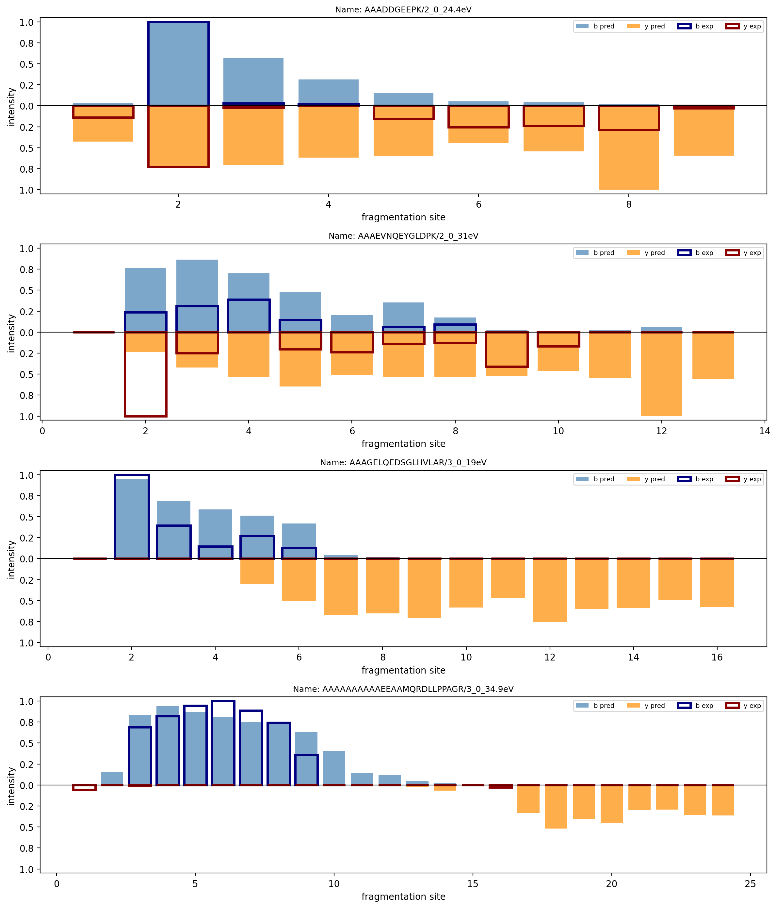

# Python coursework: AI and sequence analysis

Course assignments from the University of Waterloo, January to August 2026, in Python with NumPy and PyTorch: a spectrum-prediction Transformer with separate train and predict CLIs, a peptide-classifier CLI, an O(n log n) suffix array, dynamic-programming alignment, a decision-tree text classifier written from scratch, MDP value iteration, a best-first decoder, the forward and backward pass of a feedforward network, and K-means image segmentation.

*Four peptides from `cs482-bioseq/a3`: b ions above the axis, y ions mirrored below; filled bars are predicted intensities, outlines are experimental.*

## Map

| Directory | What it is | Start with |
|---|---|---|
| `cs482-bioseq/a3` | Spectrum prediction: parse a 17,851-record NIST library, filter to 16,211, build targets, train a Transformer, predict to JSONL | `a3-train.py`, `a3-predict.py`, `report.pdf` |
| `cs482-bioseq/a2` | Peptide classifier CLI (stdin/stdout): CNN plus multi-scale k-mer features, z-score ensemble | `program.py`, `readme.pdf` |
| `cs482-bioseq/a4` | O(n log n) suffix array with explicit stable counting sort and two-pass radix sort | `assn4.py`, `test4.bat`, `a4-report.pdf` |
| `cs482-bioseq/a1` | Fit alignment by dynamic programming, O(mn), three-line CLI output contract | `assn1-part1.py`, `readme.pdf` |
| `cs486-ai/a3` | Decision-tree text classifier from scratch in NumPy; feedforward-network forward, backward and update inside a provided framework; PyTorch regression script | `code.py`, `neural_net.py`, `train_model_pytorch.py`, `writeup.md` |
| `cs486-ai/a2` | MDP value iteration with policy extraction and an 18-configuration reward sweep | `code.py`, `writeup.md` |
| `cs486-ai/a1` | k-best best-first decoder for a probabilistic language model | `code.py`, `writeup.ipynb` |
| `cs484-kmeans` | Vectorized K-means image segmentation with an initialization study and a K sweep | `MyKmeans.ipynb` |

Each assignment folder carries the original problem statement (`assignment*.pdf`) and my own readme or report, which follows the same four headings throughout: How to Run, What Each Part Does, Complexity, Edge Cases.

## cs482-bioseq: Computational Techniques in Biological Sequence Analysis (Winter 2026)

**a3, spectrum prediction.** `a3-train.py` parses the NIST spectral library with an explicit state machine (17,851 records, filtered to 16,211), builds per-site targets, and trains a Transformer of 2.15M parameters under a 4M-parameter budget that is asserted at runtime. `a3-predict.py` is a separate inference CLI that writes JSONL. On a 1,621-spectrum held-out set the model reaches accuracy 0.84 and MSE 0.089; the report gives mean and range over 10 seeds rather than a single best run. Loss is masked over valid fragmentation sites with separate presence (BCE) and intensity (MSE) terms; thresholds are applied identically in training normalisation and prediction output. Trained weights `a3_weights.pt` (8.6 MB) are included so prediction runs without training. The library itself is not included; it is a public NIST download.

**a2, peptide classifier.** `program.py` reads peptides on stdin and writes labels on stdout. A small CNN is combined with multi-scale k-mer features through a z-score ensemble; accuracy improved from 0.667 to 0.796 with the ensemble. Reported runtime about 1.44 s and about 60 MB of memory; the whole package is 1.4 MB against a 10 MB submission budget. `peptide_cnn3Btwo.pt` and `score_params.json` (the k-mer table) are included so the CLI runs as submitted; `test_input.txt` and `test_output.txt` show the contract. The training script for the CNN is not part of this corpus. Parameter files are resolved relative to the script, weights are loaded with `weights_only=True`, and inference is batched.

**a4, suffix array.** `assn4.py` builds a suffix array in O(n log n) with prefix doubling, an explicit stable counting sort and a two-pass radix sort; comparison sorting was disallowed by the specification. `test4.bat` runs the five edge cases listed in the report.

**a1, fit alignment.** `assn1-part1.py` implements the O(mn) dynamic-programming recurrence and prints the three-line output contract required by the assignment.

## cs486-ai: Introduction to Artificial Intelligence (Spring 2026)

**a3.** `code.py` is a decision-tree text classifier written from scratch in NumPy on a 3,000-comment Reddit corpus (1,500 train, 1,500 test), comparing two information-gain criteria; 100 nodes, 70% test accuracy. Information gain is computed vectorised across all features, and both tree construction and prediction are iterative because recursion was disallowed. Tie-breaking is deterministic beyond what the specification required. `neural_net.py` and `operations.py` are the instructor's framework; my parts are the forward pass, the backward pass and the weight update, which pass the 10 public unit tests; 5-fold cross-validation gives MAE 0.66. `train_model_pytorch.py` trains a regression model with a seeded split, Adam, 500 epochs and per-epoch validation MAE (final 0.51). The comment corpus is not included.

**a2.** `code.py` implements MDP value iteration and policy extraction with the convergence criterion and tie handling exactly as specified, then runs an 18-configuration reward sweep and prints the report tables directly. `gen_output.py` wraps the CLI.

**a1.** `code.py` is a k-best, best-first (beam-limited) decoder over a probabilistic language model with negative-log-probability costs and deterministic tie keys. `writeup.ipynb` renders the search trees with matplotlib; `gen_notebook.py` generates that notebook. `model.py` is instructor-provided.

## cs484-kmeans: Computational Vision (Winter 2026)

`MyKmeans.ipynb` segments images with vectorised K-means on RGBXY features, runs an initialization-sensitivity experiment (three runs) and a K sweep from 2 to 80 with SSE recorded against K. The notebook keeps the instructor's question cells followed by my answers and code. The graph-cut project from the same course is in a separate repository, `graphcut-segmentation-gmm-dino`.

## What is mine and what was provided

| Provided by the course | Mine |
|---|---|
| All `assignment*.pdf` problem statements | All other code, reports, readmes and notebook answers |
| `cs486-ai/a1/model.py` | |
| `cs486-ai/a3/neural_net.py` and `operations.py` skeletons (my methods: forward, backward, weight update) | |
| Question cells in `cs484-kmeans/MyKmeans.ipynb` | |

## Notes

- Comments are bilingual (Chinese and English), a personal habit; identifiers are English.
- The cs486 scripts use paths from the original assignment layout; adjust the constants at the top of each file before running elsewhere.
- Data sets are not included. Instructor materials are included for context and remain the property of their authors. No licence is granted for this repository; it is a personal portfolio.
- Assignments were completed between January and August 2026 and committed here in September 2026, one commit per course.
